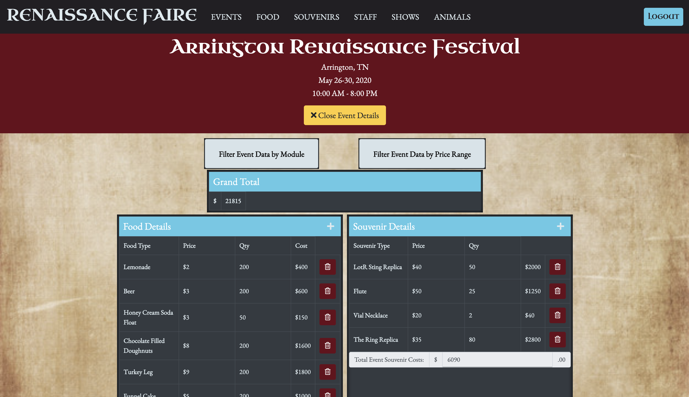

# Renaissance Faire

[Check it  out here!](https://ancarenfaire.web.app/)

## Description 
This project allows the owners of a company that runs Renaissance Fairs across the country to see the status of their fairs. They are able to see what food products, souvenirs, staff, and shows are available at each fair as well as view and analyze the costs associated with each event. They are able to add, edit, and delete information for the fairs they created when they are logged in.

## Individual Contribution
My individual role in the project included:
* Completing the READ feature for the Events collection.
* Adding a new page for viewing a single event's details. 
* Owning the Food collection for an event, which included completing the features for viewing the food on an event, adding new food items to an event, and deleting a food item from an event.
* Completing the READ and CREATE features for the Animals collection, which we added later on when a new team member joined our group. 
* Pair programming with Michele on calculating costs for each data collection in an event. 
* Allowing users to filter event data by price range. 
* Figuring out the big function with the Promise that pulled all the different data for an event at the same time. 

## Background
Our second and last group project in the Data-Driven Apps stage of our bootcamp program, the Renaissance Faire introduced a whole new twist. Our instructor shuffled the previous group projects among our cohort's teams, assigned each of the teams a whole new project they were unfamiliar with and assigned a second part of the overall project to the new team. We got to see what real-life coding is like when you inherit someone else' code and have to understand it and build on it. 

Both an an individual level and as a team, this project really helped us realize how far we have come in the program. We had a new team member join us a few days into the project and immediately all rallied to create a new collection for here so that she can own her own piece of the project and practice the "smash" skills. We all contributed and did full CRUD on the new Animals collection is 1 1/2 days! 
We got to practice our skills with what we at NSS call "smash" functions, that is, functions that pull data from multiple collections simultaneously. I got to work on the big function that makes a Promise to get data from all these different collections at the same time, nesting all the different Promise calls, and was it exciting when I finally figured it out! We also learned about AmCharts through John's research, who was the primary team member who tackled the graphs feature.

I got better at optimizing my code and learning how to refactor it to make it cleaner and more streamlined. An example of this was the function for calculating total costs for a given section on an event (food, staff, etc). It went through a couple of versions as I updated it to make sure the code met the single responsibility principle, to ensure that all data manipulation was done in the data files and the component files just controlled the display of the data returned, and to apply the .reduce() method in the claculation, which at first felt quite elusive and complicated but after a while clicked! 

Project instructions available in the Github group project here: https://github.com/nss-evening-cohort-11/nutshell-sithlords-wookies/issues/51.

## Screenshots
#### Events Dashboard

#### User's Own Events

#### Single Event Details Page

#### Graph for Event Costs

#### Adding a New Food Item 

#### Filtering Event Data by Price Range

#### Filtering Event Data by Module

## Features
* Authenticated users only have access to the new Events Dashboard.
* Users can modify and delete only events they created.
* Users can view animals, food, shows, souvenirs, and staff associated with an event.
* Users can add and delete animals, food, shows, souvenirs, and staff associated only with events they created.
* Users have access to financial reporting data for each event - the itemized as well as total costs for each set of services (animals, food, etc.) as well as the total costs for an event.
* Users can see graphs displaying the financial data for an event.

## Tools& Technologies
Axios API, Bootstrap, CSS, ES6 Modules, ESLint, Firebase, FontAwesome, Github, Google login authentication, HTML5, JavaScript, jQuery, JSON, JSONLint, Lucidchart, Moqups, Sass, Webpack

## Contributors
[Zachary Crumpton](https://github.com/ZacCrumpton)

[Sarah Holder](https://github.com/sarahholder)

[John Johnson](https://github.com/John-Ryan-Johnson)

[Michele Rawlins](https://github.com/Michele-Rawlins)

[Anca Simon](https://github.com/ancasimon)

## How To Run
1. Clone down this project.
1. Create your own `apiKeys.json` file using the template in the `apiKeys.example.json` file with your own Firebase keys.
1. Make sure you have http-server installed via npm. If not, get it [here](https://www.npmjs.com/package/http-server).
1. At the root of this project, run the following command: hs -p 9999.
1. In your browser, navigate to https://localhost:9999.

## Firebase Deployment
This project has been deployed with Firebase. 
You can access it [here](https://ancarenfaire.web.app/). 

